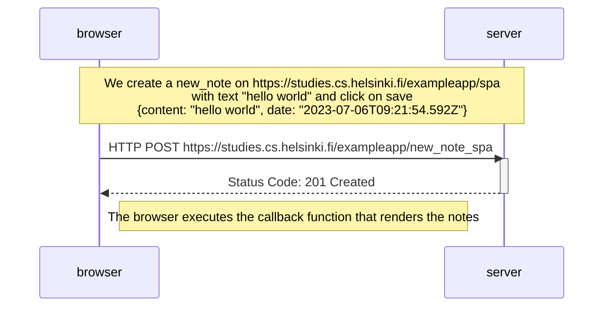

```mermaid
sequenceDiagram
    participant browser
    participant server
    Note over browser,server: We create a new_note on https://studies.cs.helsinki.fi/exampleapp/spa <br/>with text "hello world" and click on save<br/>{content: "hello world", date: "2023-07-06T09:21:54.592Z"}
    browser->>server: HTTP POST https://studies.cs.helsinki.fi/exampleapp/new_note_spa
    activate server
    server-->>browser: Status Code: 201 Created
    deactivate server

    Note right of browser: The browser executes the callback function that renders the notes
```
